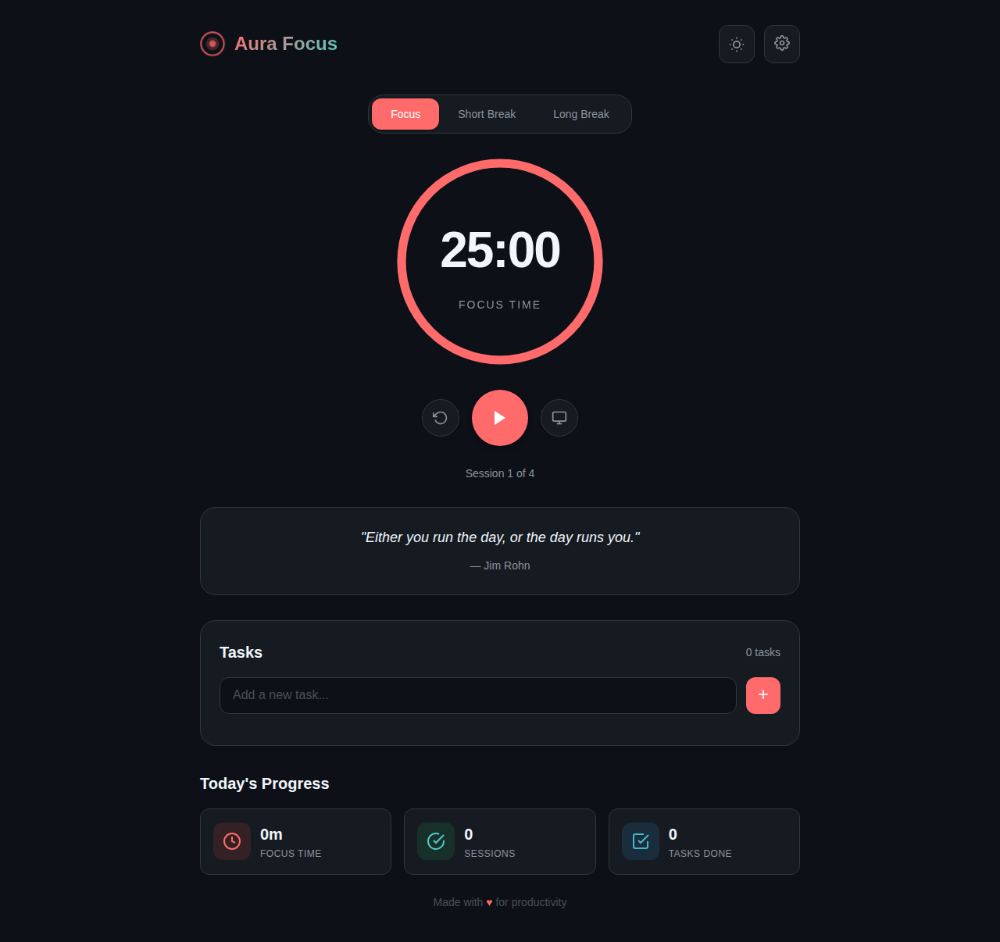

# Aura Focus 🎯

A minimalist, theme-adaptive Pomodoro timer designed to boost productivity with smooth animations, task tracking, session stats, and motivational quotes.



## ✨ Features

- **🍅 Pomodoro Timer** - Focus sessions (25 min), short breaks (5 min), and long breaks (15 min)
- **📋 Task Tracking** - Add, complete, and manage your tasks
- **📊 Session Stats** - Track daily focus time, completed sessions, and tasks done
- **💬 Motivational Quotes** - Get inspired with rotating productivity quotes
- **🧘 Zen Mode** - Distraction-free full-screen timer view
- **🔔 Sound Alerts** - Customizable audio notifications when sessions complete
- **🎨 Customizable Themes** - Light, Dark, Ocean, Forest, and Sunset themes
- **💾 Persistent Storage** - Your settings, tasks, and stats are saved locally
- **📱 Responsive Design** - Works beautifully on desktop, tablet, and mobile
- **⌨️ Keyboard Shortcuts** - Quick access with Space, R, Z, and Escape keys

## 🚀 Getting Started

### Quick Start

1. Clone the repository:
   ```bash
   git clone https://github.com/srinivasajan/Aura-Focus.git
   cd Aura-Focus
   ```

2. Open `index.html` in your browser, or serve with any static file server:
   ```bash
   # Using Python
   python -m http.server 8000
   
   # Using Node.js
   npx serve
   ```

3. Visit `http://localhost:8000` in your browser

### Using GitHub Pages

The app is also available online at: [https://srinivasajan.github.io/Aura-Focus](https://srinivasajan.github.io/Aura-Focus)

## ⌨️ Keyboard Shortcuts

| Key | Action |
|-----|--------|
| `Space` | Start/Pause timer |
| `R` | Reset timer |
| `Z` | Toggle Zen mode |
| `Escape` | Exit Zen mode or close settings |

## 🎨 Themes

Aura Focus comes with 5 beautiful themes:

- **Light** - Clean and bright for daytime use
- **Dark** - Easy on the eyes for night owls
- **Ocean** - Cool blues and teals for a calming atmosphere
- **Forest** - Natural greens for an earthy feel
- **Sunset** - Warm tones for a cozy experience

## ⚙️ Customization

Access the Settings modal to customize:

- **Timer Durations** - Set custom lengths for focus, short break, and long break sessions
- **Sessions until Long Break** - Configure how many focus sessions before a long break
- **Sound Alerts** - Enable/disable and adjust volume
- **Theme** - Choose from 5 available themes
- **Data Management** - Reset all data if needed

## 🏗️ Project Structure

```
Aura-Focus/
├── index.html      # Main HTML structure
├── styles.css      # Styling and themes
├── app.js          # Application logic
└── README.md       # Documentation
```

## 🛠️ Technologies

- **HTML5** - Semantic markup
- **CSS3** - Custom properties, animations, flexbox, grid
- **JavaScript (ES6+)** - Class-based architecture, Web APIs
- **Web Audio API** - Sound generation
- **LocalStorage API** - Data persistence
- **Notifications API** - Desktop notifications

## 📱 Browser Support

- Chrome 60+
- Firefox 55+
- Safari 12+
- Edge 79+

## 🤝 Contributing

Contributions are welcome! Please feel free to submit a Pull Request.

## 📄 License

This project is open source and available under the [MIT License](LICENSE).

## 💖 Acknowledgments

- Inspired by the [Pomodoro Technique®](https://francescocirillo.com/pages/pomodoro-technique) by Francesco Cirillo
- Designed with love for productivity enthusiasts everywhere

---

Made with ❤️ for productivity